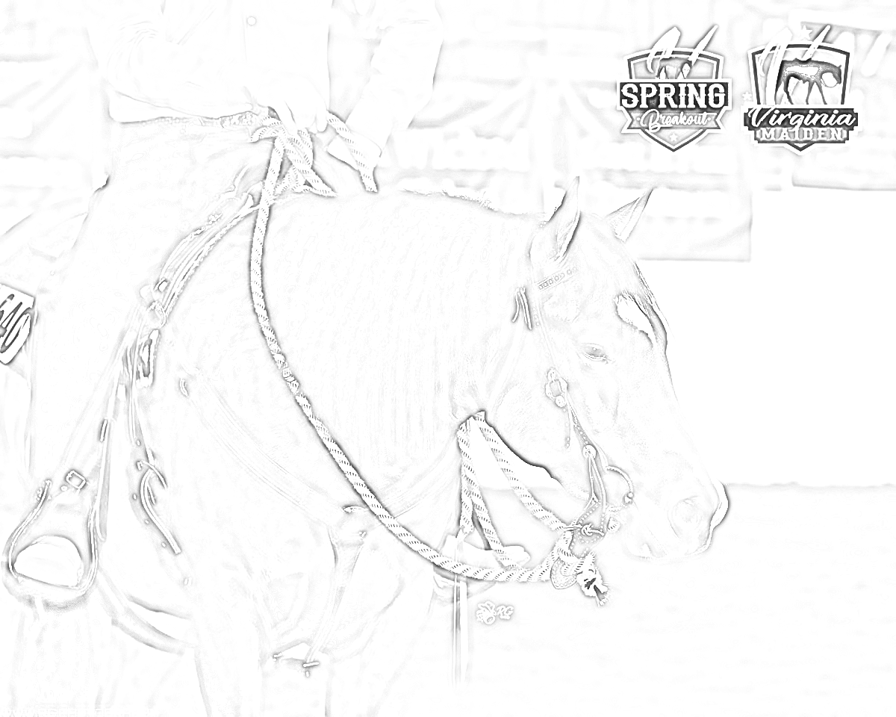
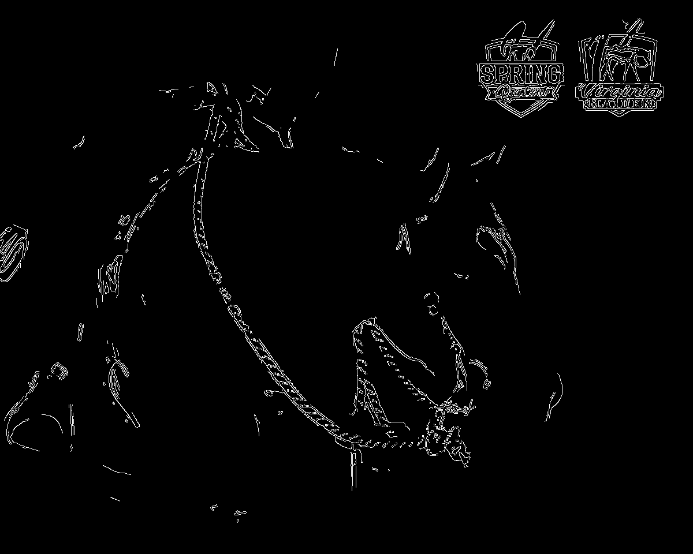

# Line Drawing App

Line Drawing App is a web application that can transform images into a pencil-sketch-like line drawing. The application is built with Python and Streamlit.

[See it in action!](https://dovarfalcone-linedrawing-line-iew33h.streamlit.app/)

## Usage

1. Upload an input image by clicking on the "Upload input image" button.

2. Adjust the parameters for edge-preserving smoothing, Gaussian blur, and Canny edge detection using the sliders in the sidebar.

3. Click on the "Generate line drawing" button to generate the line drawing.

4. The input and output images will be displayed on the page. The generated line drawing will also be saved as a GIF file, which can be downloaded by clicking on the "Download GIF" button.

## Installation

1. Clone this repository:

`git clone https://github.com/DovarFalcone/linedrawing.git`

2. Install the required packages:

`pip install -r requirements.txt`

3. Run the application:

`streamlit run line.py`

### Input Image

### Output Images

        

### Generated GIF

